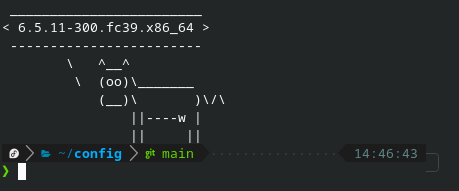

# Fish Config

A nice clean shell.

## Installation

1. Packages: `fish fzf fd bat`
2. Install [fisher](https://github.com/jorgebucaran/fisher#installation).
Note: install from fish, not bash.
3. Nerd Fonts: https://github.com/IlanCosman/tide#fonts
4. Default shell: `chsh -s /usr/bin/fish` (logout needed)
5. Set colors: `fish_config`
6. Disable greeting: `set -U fish_greeting`
7. `ln -sf ~/config/fish/config.fish ~/.config/fish/config.fish`
8. `cp ./fish/fish_plugins ~/.config/fish && fisher update`

## fzf plugin

- Search Directory: `Ctrl`+`f`
- Git Log: `Ctrl`+`l`
- Git Status: `Ctrl`+`s`
- History: `Ctrl`+`h`
- Processes: `Ctrl`+`Alt`+`p`
- Variables: `Ctrl`+`Alt`+`v`

## Credits

- [awsm.fish](https://github.com/jorgebucaran/awsm.fish)