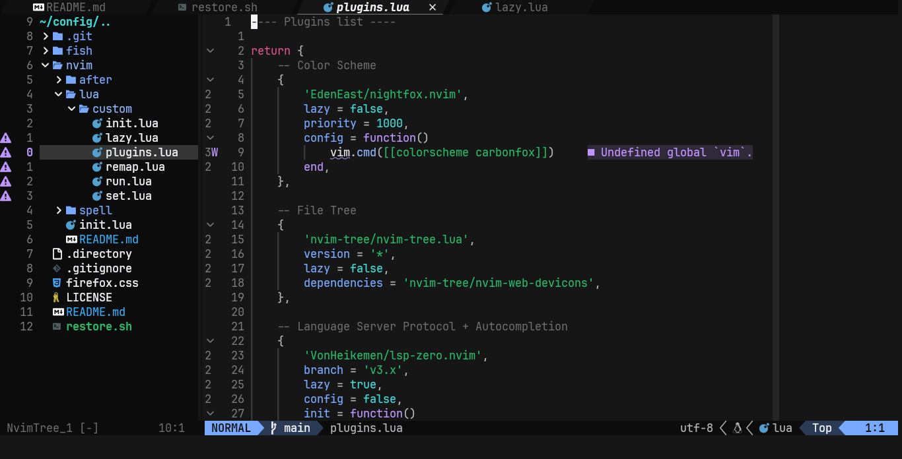

# Neovim config

This is a super shitty neovim config, please be kind.

## Installation

1. Install `neovim ripgrep` packages
2. Install [nerd font](https://www.nerdfonts.com/font-downloads) (JetBrainsMono preferred for Neovide)
3. Create symlink `~/.config/nvim` pointing to `./nvim` (or just copy files)
4. Launch `nvim` and wait until everything is installed (`:Lazy`, `:Mason`)
5. Relaunch neovim to apply all changes

## Spell checking

1. Download files (lang is your spell checking language):
- https://ftp.nluug.nl/pub/vim/runtime/spell/lang.utf-8.spl
- https://ftp.nluug.nl/pub/vim/runtime/spell/lang.utf-8.sug
2. Put downloaded files in `nvim/spell/`

## Credits

- [0 to LSP : Neovim RC From Scratch](https://youtu.be/w7i4amO_zaE)
by [ThePrimeagen](https://www.youtube.com/@ThePrimeagen)
